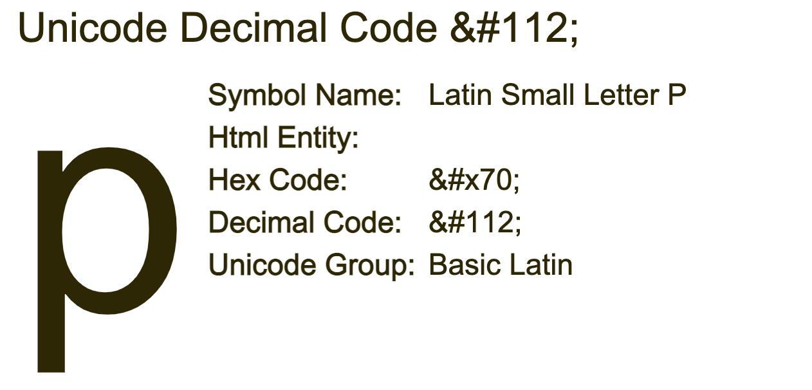

# Nice netcat...

Author: SYREAL
Description: There is a nice program that you can talk to by using this command in a shell: $ nc mercury.picoctf.net 22902, but it doesn't speak English...

Date: 23/01/2023

---

## Steps

- I execute the command in the terminal and got a lot of numbers

  - nc mercury.picoctf.net 22902
- After looking the number i see that it dont went over 150, then i went to google and search the first number 120.
- I searched**character 112**, the first page gave me the answer [link](https://www.codetable.net/decimal/112)
- 
- Then i decised to convert all number from unicode to symbol, but i had to add the **&#** in the beggiging of the number and **;** at the end.
- To improve my coding i decided to create a tool to prepend, append and concatenate the values
  - Folder: tools / python: filetext_helper.py
- python3 tools/filetext_helper.py -pre="&#" -ape=. content.txt -out=line > ctf.html
- I saved the output in a html because it will be converted from unicode to symbol by the browser
- The output was the flag but it had period (.) between each letter, I just search a website to remove this online [used this](http://www.unit-conversion.info/texttools/replace-text/)

---

## Opinion

It was fun to do it, I think it teaches converting and different types of content. 
