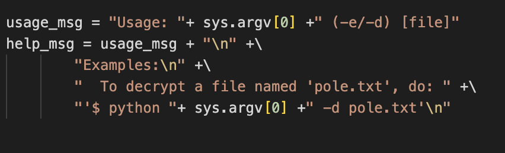

# Python Wrangling

Author: SYREAL
Description: Python scripts are invoked kind of like programs in the Terminal... Can you run this Python script using this password to get the flag?

Date: 22/01/2023

---

## Steps

- Download the python script(ende.py), password(pw.txt), flag(flag.txt.en)
- Open the python script and read the role file
- Focus on the begging

  - First line show me we fave 2 parameters, when I love at this after read the file, i think its**e** for encrypt and**d** for decrypt
  - Then when i return to the ctf descryption I understand what i have to do.
    - Open the terminal in the same folder as the files
    - Run the command: python3 ende.py -d flag.txt.en
      - Inform the password

  

---

## Opinion

I think this can help people to understand how to run a python script, use parameters and start to understand the python structure.
