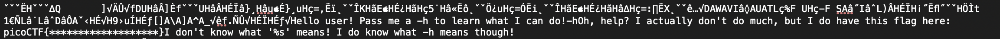
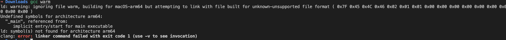

# Wave a flag

Author: SYREAL
Description: Can you invoke help flags for a tool or binary? This program has extraordinarily helpful information..

Date: 22/01/2023

---

## Steps

- Download the file from the site
- In macos run the command `file -I ./warm`
- I didnt know the format so i run the more complete command `file ./warm`
- After some shearch seams the file was compiled by GCC
- I tried giving executable permition, even after some test run as sudo (shouldn't) and could not run the script

  - I tried ./warm (-h,-help,help,--h)
- Then i open the script in a text editor and inside it has the message it probably would show if the command above worked.

  
- As the text shows it should work with -h, but i could now get the flag
- I tried to run the program like this `gcc warm`
- Then it show the error about architecture. Im using a Macos M1 (ARM)

---

## Opinion

If someone run the script in a intel computer it should be simples how to solved it.
